# Img Review for Codex

Annotate screenshots, generated images, and UI captures so Codex can understand exactly what you want changed.



Img Review is a local Codex plugin and skill for visual feedback during vibe coding. Instead of trying to describe "move this card a little left" or "make this selected element look like that" in vague text, you can mark the image directly, select visual elements, move/scale/rotate them into the target state, and send structured instructions back to Codex.

## Why This Exists

Vibe coding is fast until the design feedback becomes visual.

Natural language is often too fuzzy for image and UI changes:

- "Make this part cleaner."
- "Move this element over there."
- "Use that shape, but smaller."
- "The button should feel more like the mockup."

Img Review gives Codex a visual editing layer for those moments. It keeps the convenience of conversational coding, but adds precise spatial feedback when words are not enough.

## Core Advantages

- **Runs inside the Codex in-app Browser**  
  The review canvas opens as a Codex-native workflow. You do not need to bounce between external tools just to explain a visual change.

- **Fast element selection**  
  Magic selection lets you brush over a region and quickly capture the element or area you want Codex to modify.

- **Visual target transforms**  
  Move, scale, and rotate selected elements to show the desired result. Codex receives the target transform as structured data, not just a prose guess.

- **Clear before/after intent**  
  Transformed selections show the original state and target state separately, so the requested change is easier to understand.

- **Convenient, lightweight workflow**  
  Drop in an image, mark it up, optionally add comments, and send the review to Codex. Written notes are helpful, but not required for transform-based feedback.

## What It Does

- Opens a local annotation canvas in the Codex in-app Browser.
- Imports images by upload, paste, drag-and-drop, or CLI arguments.
- Supports box, arrow, point, and freehand annotations.
- Supports Magic selection with brush-style region selection, add/subtract modes, tolerance, sampling, and edge smoothing.
- Lets you move, scale, and rotate selected image elements to demonstrate the target design.
- Shows clear Before/After indicators for transformed selections.
- Exports `annotations.json`, `review.md`, `ai-task.json`, and `ai-task.md`.
- Includes a Codex skill that tells Codex how to consume the exported feedback and revise images or UI code.

## Use Cases

- Review generated images and describe exactly which region should change.
- Mark UI screenshots during vibe coding and turn visual feedback into implementation tasks.
- Compare design iterations and send structured feedback to Codex.
- Demonstrate intended placement, scale, and rotation without writing long prompts.
- Hand off visual QA notes as machine-readable annotations.

## Quick Demo

Try the included public sample:

```bash
python3 scripts/open_img_review.py \
  --session-dir /tmp/img-review-sample \
  --image examples/sample-ui.svg
```

Then open the printed URL, select or mark a region, move/scale/rotate it, and press **Send to Codex**.

## Repository Layout

```text
.codex-plugin/plugin.json      Codex plugin manifest
skills/img-review/SKILL.md     Codex skill workflow
scripts/open_img_review.py     Launcher that starts or reuses a local server
scripts/img_review_server.py   Dependency-free local HTTP server
assets/                        Browser UI
examples/sample-ui.svg         Public sample image for a quick test
tests/                         Python unit tests
```

## Install For Local Codex Development

Codex installs plugins from configured marketplaces. For local development, use a personal marketplace entry that points at this checkout.

One convenient layout is:

```bash
mkdir -p ~/plugins
git clone https://github.com/z5396120-maker/img-review.git ~/plugins/img-review
```

Then ensure your personal marketplace at `~/.agents/plugins/marketplace.json` includes:

```json
{
  "name": "personal",
  "interface": {
    "displayName": "Personal"
  },
  "plugins": [
    {
      "name": "img-review",
      "source": {
        "source": "local",
        "path": "./plugins/img-review"
      },
      "policy": {
        "installation": "AVAILABLE",
        "authentication": "ON_INSTALL"
      },
      "category": "Productivity"
    }
  ]
}
```

Install it with:

```bash
codex plugin add img-review@personal
```

During local iteration, bump the plugin cachebuster or reinstall through your normal Codex plugin development flow.

## Run Without Installing

You can run the annotation server directly:

```bash
python3 scripts/open_img_review.py \
  --session-dir /absolute/path/to/.img-review/session \
  --image /absolute/path/to/screenshot.png \
  --json
```

Or start the server directly:

```bash
python3 scripts/img_review_server.py \
  --session-dir /absolute/path/to/.img-review/session \
  --image /absolute/path/to/screenshot.png
```

Open the printed URL in the Codex in-app Browser or a local browser for manual testing.

## Codex Workflow

After installing the plugin, ask Codex:

```text
Use $img-review to annotate this screenshot, apply the saved feedback to the UI,
verify the updated page, and prepare a commit.
```

You can also use natural prompts such as:

```text
Open Img Review for this screenshot.
Mark up this generated image and send the changes to Codex.
Compare these two UI versions and turn the review into implementation tasks.
```

Codex plugins cannot replace the native image attachment viewer or trigger merely because a user clicks an image. Send the image with review intent to start the workflow.

## Output Files

Each session writes:

```text
assets/           Copied source images
annotations.json  Structured normalized annotations
review.md         Human-readable review notes
ai-task.json      Executable handoff for Codex
ai-task.md        Human-readable handoff
```

Review sessions are local work artifacts. Do not commit `.img-review/` unless your team explicitly wants to keep review records.

## Suggested GitHub Topics

`codex`, `openai`, `ai-tools`, `vibe-coding`, `image-annotation`, `ui-review`, `design-review`, `developer-tools`

## Development

Run checks:

```bash
python3 -m unittest discover -s tests -v
node --check assets/app.js
```

If you have the Codex plugin validator available:

```bash
PYTHONPATH=/path/to/validator-deps \
python3 /path/to/validate_plugin.py .
```

## License

MIT
